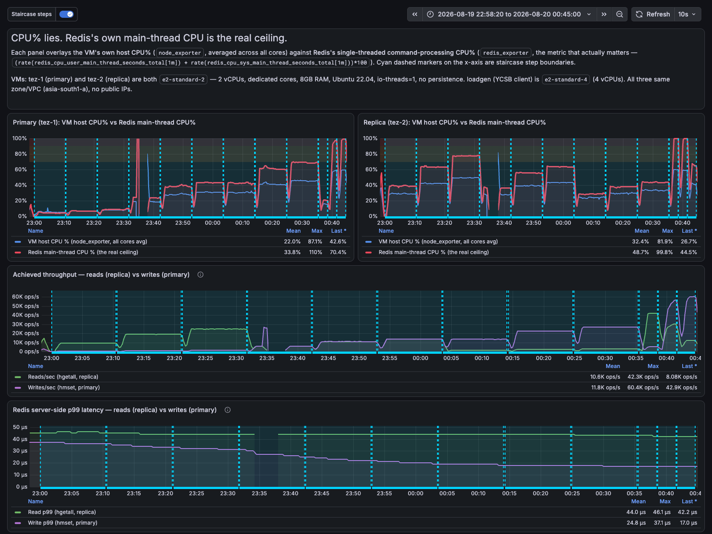

A few weeks ago I was pulled into a production support thread. A
self-managed Redis cluster — a 4-core, 32GB box, nothing exotic — was
showing rising latencies. The instinctive first move was to check CPU.
It read **50%**.

Fifty percent, on a machine with four cores, is the kind of number that
makes you look elsewhere. Half the machine is sitting idle. Surely Redis
isn't the bottleneck.

Except it was. And the question that came out of that thread stuck with
me: **how do you actually know, ahead of time, when a Redis instance
needs to scale — and whether "scale" means a bigger box or more of
them?**

I didn't have a confident answer. So I built a benchmark rig and hammered
it with real traffic until it genuinely broke — twice, deliberately.
First a standalone instance, to isolate the core mechanism without extra
variables. Then a real primary/replica pair, because that's how almost
everyone actually runs Redis in production, and I wanted to know whether
the same numbers still hold once a replica is in the picture.

## The 50% CPU number was never the right number

Here's the thing almost nobody's dashboard accounts for: **Redis
executes commands on a single thread.** Not "mostly single-threaded" —
by default, one thread does all the work of reading your request,
running your command, and writing the response. GCP, AWS, your laptop,
it doesn't matter how many cores the box has. Redis will use, at most,
one of them for the thing that actually matters.

So on that 4-core box, Redis's ceiling isn't 400% CPU (all four cores) —
it's **100% of one core**. Which is 25% of the *host's* total capacity.
A host-level CPU chart showing "50%" on a 4-core machine could mean all
sorts of things — but one very plausible one is that Redis's own single
core is already maxed out, and something else is also busy, and the
average across four cores just happens to land on 50%. **The aggregate
number tells you almost nothing about whether the thing that actually
processes your commands is out of room.**

This is the debunk: **CPU% on the host is the wrong metric for Redis
capacity, full stop.** You need CPU as a fraction of *one core*,
specifically the core Redis's command loop runs on. Everything else in
this post is what happens once you start watching the right number — on
a standalone instance first, then on a primary/replica pair.

## Part 1: proving it on a standalone instance

I didn't want to write "trust me, watch main-thread CPU" without
actually watching it happen. So I built a small benchmark rig — a
dedicated Redis instance and a separate load generator — and drove three
different traffic shapes at it with [YCSB](https://github.com/brianfrankcooper/YCSB):

- **Read-heavy** (95% reads / 5% writes) — a cache-like pattern
- **Write-dominant** (90% writes / 10% reads) — session stores, counters
- **Mixed** (50/50) — shopping carts, most "normal" app traffic

For each one, I climbed a load staircase — more concurrent requests,
more throughput — until Redis genuinely couldn't keep up, watching
server-side metrics via Prometheus the whole way.

### The three ceilings

| Traffic shape | Sustained ceiling | Main-thread CPU at ceiling |
|---|---|---|
| Read-heavy | ~25,000 ops/sec | ~93-99% |
| Mixed | ~26,200 ops/sec | ~85-97% |
| Write-dominant | ~28,700-29,000 ops/sec | ~75-85% |

Same hardware, three different ceilings. Writes are cheaper for Redis to
execute than reads in this record shape (writing a hash field is less
work than reading all of them back), so write-heavy traffic gets more
headroom before the single core saturates. **There's no single "Redis
can do N ops/sec" number — it depends entirely on what your traffic
actually looks like.** Which is exactly why watching CPU-of-one-core,
not a fixed throughput target, is the metric that survives your traffic
mix changing.

### The trap: Redis's own latency metric doesn't warn you either

I assumed, going in, that if CPU alone wasn't the smoking gun, at least
Redis's own reported latency would climb as a warning sign. It doesn't.
I pushed main-thread CPU from 58% to 93% — most of the way to
saturation — and Redis's own server-side p99 latency moved from **30
microseconds to 33**. Basically flat.

That's because Redis only times how long a command takes to *run*, not
how long it sat waiting in line first. Once the single core is busy,
new requests queue up — and that queueing delay, the thing that actually
makes your application feel slow, is invisible to Redis's own metrics.
**If your alerting watches Redis's reported latency, it will not warn
you in time.**

### Does Redis actually fall over, or just get slow?

One more thing worth knowing before you decide how urgently to react to
any of this: I pushed all three traffic shapes to **4x** their sustained
ceiling and held it there for two and a half minutes, to see what
"ignoring the warning" actually costs.

**Redis did not fail.** No errors, no dropped connections, nothing
crashed. It queued everything and kept serving, just slower.

But "just slower" isn't the same story for every traffic shape:

| Traffic shape | p99 latency at ceiling | p99 latency at 4x overload |
|---|---|---|
| Read-heavy | 23.7ms | **138.8ms** (~6x) |
| Mixed | 21.6ms | **134.3ms** (~6x) |
| Write-dominant | 19.6ms | 20.7ms (barely moves) |

Read-heavy and mixed traffic hit a wall and the tail latency explodes.
Write-dominant traffic degrades far more gracefully. If your service is
read-heavy, missing the warning threshold is a much bigger deal than if
it's write-heavy — worth knowing which kind of traffic you're actually
running before you decide how much margin to leave yourself.

## Part 2: does a real primary/replica pair change the story?

A standalone instance is the clean way to prove a mechanism, but it's
not how most people actually run Redis — there's usually a primary
taking writes and one or more replicas serving reads, so the primary
stays free. So I rebuilt the rig as a real primary/replica pair (same
hardware class as Part 1, dedicated 2-vCPU cores on both sides — a
shared-core instance size caused enough host-placement noise on its own
to be a confound, worth bumping past before trusting any of the numbers
below) and ran the same three traffic shapes again, this time with reads
routed to the replica and writes to the primary — the actual read/write
split most people configure — each step held for ten minutes for
stable readings.

### The finding: a replica's CPU isn't just its own read traffic

A replica's main-thread CPU is doing two jobs at once — serving the
reads you send it, *and* continuously applying the stream of writes
replicated from the primary — and the second job doesn't show up
anywhere in your read-traffic numbers. Using the read-heavy staircase to
work out roughly how much CPU a given read volume alone should cost, the
write-dominant staircase tells a different story:

| Replica's own read load | CPU predicted from reads alone | CPU actually observed | Writes being replicated to it |
|---|---|---|---|
| 1,500 reads/sec | ~6.5% | **40.5%** | 13,500/sec |
| 2,500 reads/sec | ~11% | **38.9%** | 22,500/sec |
| 3,000 reads/sec | ~13% | **45.5%** | 27,000/sec |

The replica's CPU sits **~30 percentage points above** what its own read
traffic would predict, every time — and it tracks the volume of writes
being replicated to it, not the reads it's actually serving. Here's the
full picture, host CPU% against Redis's own main-thread CPU% for both
sides, plus achieved throughput and server-side latency, across the
whole staircase:



### Overload and latency: the same two findings, more pronounced

Pushed to 4x overload, the split topology behaved exactly like Part 1 —
**no failures**, just queueing, on both the primary and the replica.
And the latency trap was, if anything, worse: Redis's own server-side
p99 for reads stayed inside **42-46 microseconds across the entire
staircase, including 4x overload** — under 10% variation start to
finish — while what the client actually experienced told a completely
different story:


Client-observed p99 for reads went from 663µs at the lightest step to
**8,503µs under 4x overload** — a 13x increase that Redis's own metrics
never showed even a hint of.

## So: when do you scale up, and when do you scale out?

This is the part that actually answers the original question — for
both a standalone instance and a primary/replica pair.

**Watch this metric:**
```
rate(redis_cpu_user_main_thread_seconds_total[1m])
  + rate(redis_cpu_sys_main_thread_seconds_total[1m])
```
— a fraction of *one* core, sourced from `redis_exporter`. Alert at
**70%** (start planning) and **90%** (act now) on a standalone instance.
Not host CPU%. Not Redis's own latency numbers.

**If you're running a primary/replica pair, don't reuse those same
thresholds on the replica.** Watch primary and replica CPU as two
separate series, and watch the primary's write rate alongside replica
CPU — a replica CPU spike with flat read traffic means the write rate
went up, not the read rate. And when sizing read replicas for capacity,
budget for the replication-apply tax, not just the read QPS you expect
to send them — a replica never gives you a full standalone instance's
worth of read headroom.

**When the alert fires, don't reach for a bigger box by reflex.** Since
the bottleneck is one thread, adding vCPUs to the same instance does
almost nothing — proven directly in my testing, where a 2-vCPU host
behaved identically to what a single-core ceiling predicts regardless of
the second core sitting idle. The only *vertical* levers that genuinely
help are a CPU with a faster single core, or enabling Redis's I/O
threading (which offloads network handling, not command execution).

The real fix, almost always, is **scaling out**:
- **Read-heavy traffic → add read replicas.** Reads are the expensive
  operation; offloading them frees the primary's one core to focus on
  writes — just budget for the replication-apply tax above, not the raw
  read QPS alone.
- **Write-heavy or mixed traffic → shard (Redis Cluster).** Replicas
  don't relieve write load; splitting the keyspace across multiple
  single-core shards does.
- One caveat worth taking seriously: sharding assumes reasonably even
  key access. If your traffic has hot keys, one shard can still hit the
  same ceiling alone while the others sit idle — worth checking your
  real access pattern before assuming sharding buys you a clean
  multiple of the single-instance ceiling.

That's the answer I wish I'd had in that support thread: the CPU number
everyone was staring at wasn't lying about the box — it was answering a
question nobody was actually asking.

## Digging deeper

The full write-up — every workload's complete load staircase for both
the standalone instance and the primary/replica pair, the raw numbers,
the methodology, and the actual Prometheus alerting rules I ended up
with — is here as a
[GitHub Gist](https://gist.github.com/jenish-jain/835fefec919d841711d76e1b60f76529).
