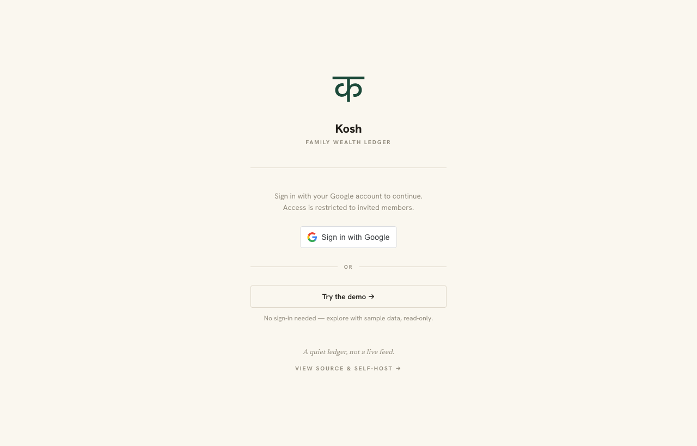
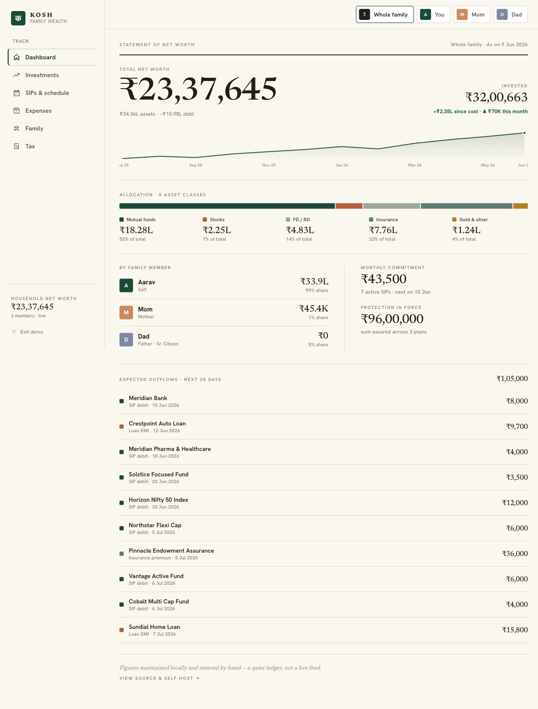
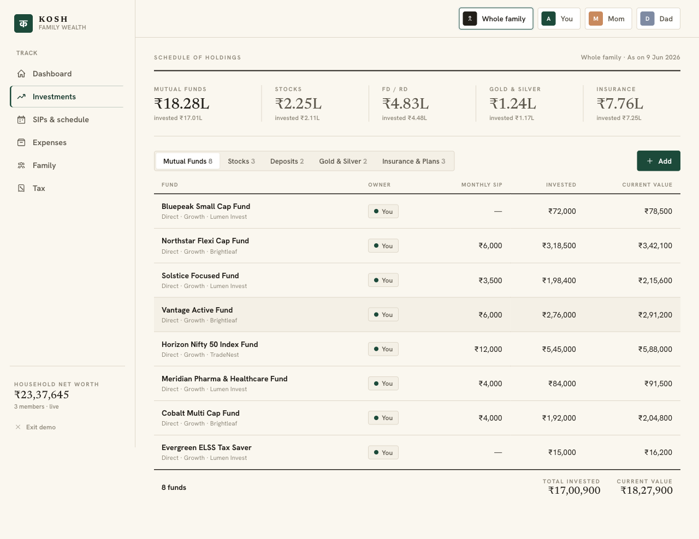
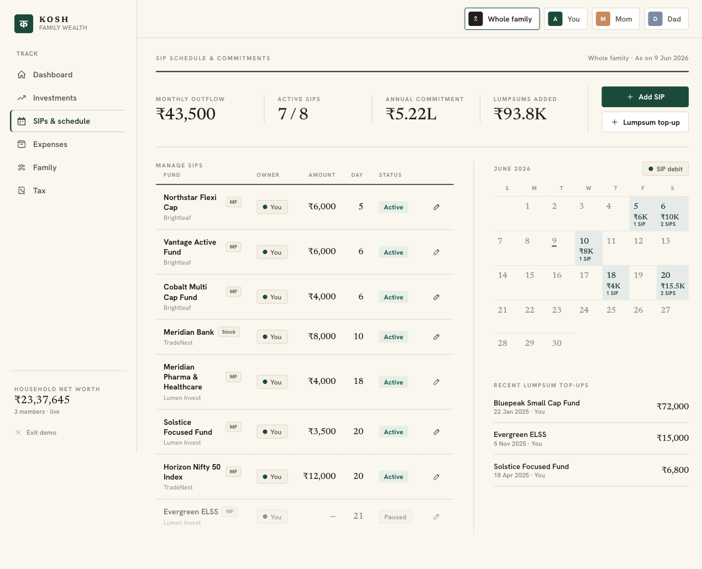
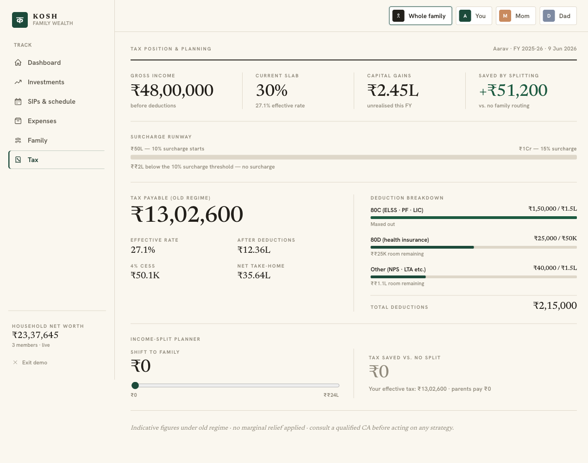
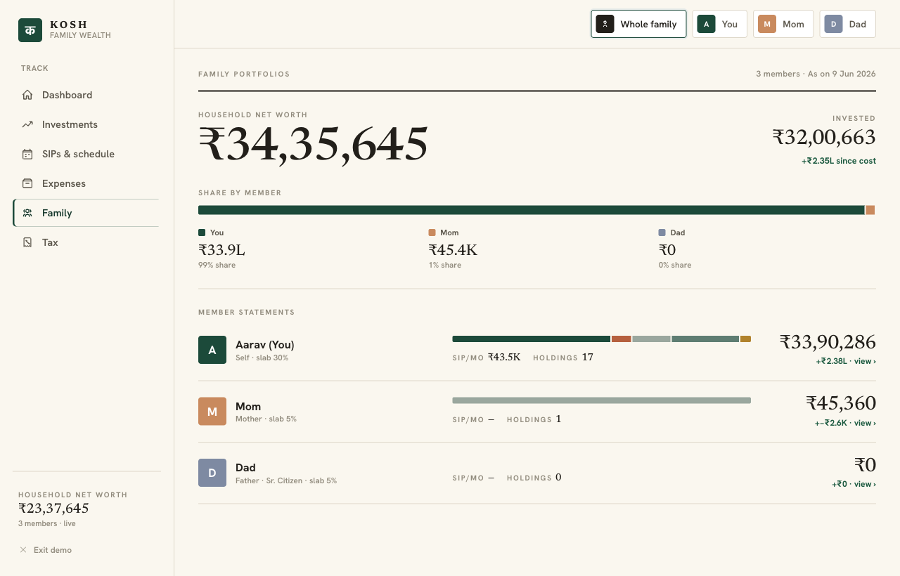
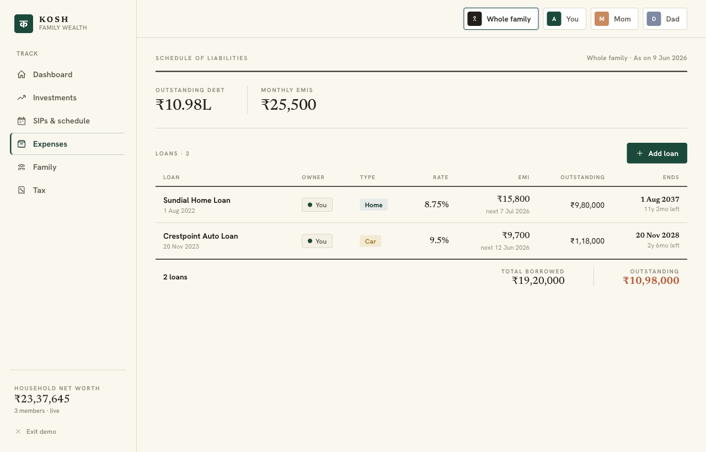

For the longest time, our family's finances lived across five different apps, two spreadsheets, and a WhatsApp message thread that somebody's dad keeps adding to.

One tab tracked the mutual funds. Another had the FDs. Insurance documents were a folder in Google Drive. The stock portfolio lived inside a broker app. Gold was just… a number someone remembered. And loans? Ask the relevant person and hope they have the latest EMI figure.

I wanted one screen that answered "where are we, financially, right now?" — for the whole household, across every member, for every asset class. Something calm. Something I could check on a Sunday morning without logging into four apps.

So I built **Kosh** (कोश — Sanskrit for treasury).

## The problems I was actually trying to solve

### 1. Privacy — I don't want to hand my bank login to anyone

Every "wealth aggregator" app in India (there are many) has the same ask: connect your bank account or give us your credentials. I understand why — it's the fastest way to pull in real-time data — but it means your entire financial picture is sitting on someone else's server, queryable by people you don't know, under a terms-of-service you didn't fully read.

Kosh doesn't do any of this. There is no sync, no API scraping, no broker OAuth. You type numbers in. You own all of it.

### 2. The spreadsheet problem

A Google Sheet works fine... until you have eight family members, twelve mutual fund folios, three FDs, and a ULIP from 2017 that nobody fully understands. At that point it becomes a maintenance job in itself — keeping formulas consistent, copy-pasting gain calculations, remembering which column is which.

I wanted the *feel* of a spreadsheet (you decide what goes in, you can see everything) without the maintenance overhead.

### 3. Multi-member tracking

Most personal finance apps are personal. They track one person's portfolio. But household wealth is shared — my parent's FDs, my partner's SIPs, and my stocks should all roll up into one "where are we" number, while still being separately viewable.

---

## What Kosh actually looks like



The sign-in screen is intentionally sparse. There's a "Try the demo" button if you want to poke around before committing to anything.

### Dashboard: one number for the whole household



The dashboard gives you the whole picture at a glance — total net worth, how it's allocated across asset classes, monthly SIP commitment, insurance cover in force, and a sparkline of how the number has moved over time. You can switch between "whole family" and individual members via the chips at the top.

### Investments: every folio, every holding



Mutual funds, stocks, fixed deposits (FD & RD), gold, and insurance are all tracked here. Values are updated manually — which sounds like a chore but for a household portfolio is actually fine (once a week or once a month is enough). Fixed deposit and RD values are calculated automatically from the rate and date you entered, so you don't need to look those up.

### SIPs & schedule: what's coming out this month



Active SIPs are tracked alongside a monthly calendar so you can see what's hitting your account and when. Particularly useful at the start of the month or if you're managing cash across accounts.

### Tax view: actual numbers, across the family



This is my favourite screen. It shows your household's income tax position — gross income, deductions (80C, 80D, others), capital gains realised this year, income shifted to parents to utilise their lower tax slabs, and the net tax estimate under new vs old regime. All the numbers you need when you're doing your March planning.

### Family view: who owns what



Each member has their own portfolio view. Click on any member from the dashboard to see their holdings, asset allocation, and net worth in isolation.

### Loans & insurance



Loans track outstanding balance, EMI, and days until next payment. Insurance tracks premium, cover amount, and due dates. Both feed into the dashboard's "upcoming outflows" section so you never miss an EMI or premium renewal.

---

## The tech: deliberately boring

The backend is **Go** talking directly to the **Google Sheets API** — no intermediate database. The sheet you point Kosh at *is* the database. You can open it in a browser, edit cells directly, export it as Excel, or back it up to Drive. No migrations, no backup scripts, no schema files.

The frontend is **React + Vite** with a hand-rolled editorial design — serif numerals, hairline rules, a slightly ivory background. No component library. I wanted it to feel like a well-typeset ledger, not a SaaS dashboard.

Auth is optional Google Sign-In, restricted to an allowlist of emails. If you're running it at home on a trusted network, you can skip auth entirely.

---

## Running it for free (or close to it)

Here's the cost breakdown for a self-hosted Kosh:

| Service | Tier | Cost |
|---|---|---|
| Railway | Free tier (or Hobby at $5/month) | ₹0–₹420/month |
| Google Sheets | Free | ₹0 |
| Google Sign-In | Free | ₹0 |
| Anthropic AI (document parsing) | Pay-per-use, optional | ~₹0–₹10/month at low usage |

The only real decision is Railway vs. alternatives. Railway's free tier is enough for personal use (it sleeps after inactivity, which is fine for a family tool). If you want it always-on, the Hobby plan is $5/month. You could also run it on a Raspberry Pi, a VPS, or any machine that can run a Docker container — the Dockerfile is in the repo.

**Total for most people: ₹0/month.** Google Sheets storage is free up to 15GB. The app itself is about 8MB Docker image.

---

## Try it first, then self-host

The live demo is available at the sign-in screen — no Google login, no setup. It loads a realistic sample portfolio (fictional names and numbers) so you can click through all the screens.

If it fits how you think about money, the self-hosting guide is at [github.com/jenish-jain/kosh](https://github.com/jenish-jain/kosh). The README has a quick start and there's a `docs/SELF_HOSTING.md` with the full guide — connecting your sheet, adding auth, deploying.

The short version:

```bash
git clone https://github.com/jenish-jain/kosh
cd kosh
make install
make dev       # Go on :8080, Vite on :5173, no credentials needed
```

Open http://localhost:5173 and it loads with sample data immediately.

---

## Why I'm open sourcing it

This started as a purely personal tool — I wasn't sure anyone else would find it useful. But the more I talked about it, the more I realised the problem is universal: every Indian family has some combination of mutual funds, FDs, insurance, gold, and loans, and no clean way to see them together.

If Kosh fits your family's setup, I'd love for you to self-host it. If something's missing or broken, open an issue or send a PR — the code is straightforward enough that a weekend contribution is very doable.

A few things that would make good first contributions:

- Support for NPS tracking
- A mobile-friendly layout
- Import from CAMS/KFintech CAS statement
- Better chart views on the dashboard

The repo is at **[github.com/jenish-jain/kosh](https://github.com/jenish-jain/kosh)**. If you end up running it, I'd genuinely love to hear about it.
